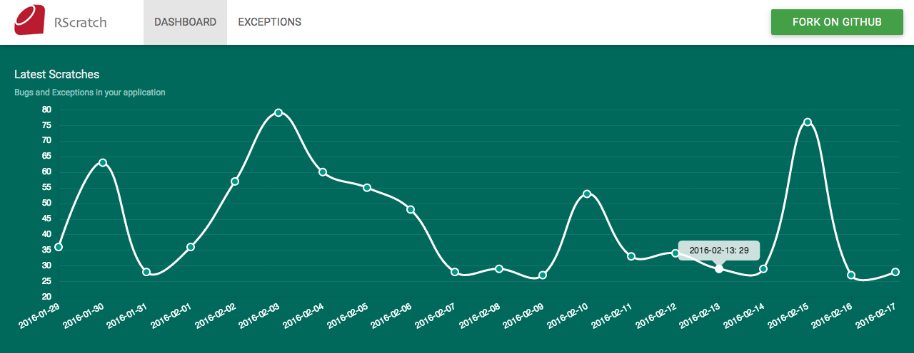
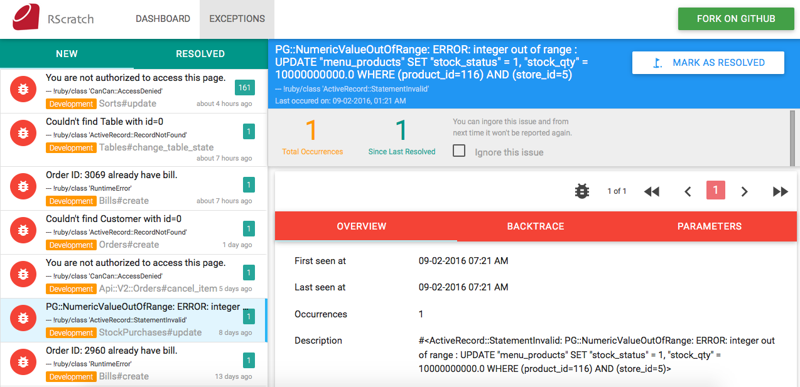

By [Avishek Jana](https://github.com/avishekjana)

[](https://badge.fury.io/rb/rscratch)

RScratch is a Ruby on Rails gem that helps you to manage bugs in your application. Think RScratch as a self-hosted bug tracker alternative you can easily integrate into your site.

### Features
* Completely designed for Ruby on Rails.
* Self-hosted.
* Easy integration.
* Data representation in both grathical and tabular format.
* UI is developed on top of Material Design.
* Exception log comes with full backtrace, parameters, client details and request preconditions.

### Screenshots

#### Dashboard


#### Exception Details


## Installation

Add this line to your application's Gemfile:
```ruby
  gem 'rscratch'
```
And then execute:
```ruby
  $ bundle install
```
After you install RScratch, you need to run the generator:
```ruby
  $ rails g rscratch:install
```

The generator will create few migration files, a initializer file, and routes to access Rscratch WebUI. It is imperative that you take a look at it. When you are done, you are ready to run migration using the following command:
```ruby
  $ rake db:migrate
```
You should restart your application after installing RScratch gem.

## Usage
Add this following line in rescue block of your your code. An example is given below
```ruby
  Rscratch::Exception.log e,request
```

An example is given below

```ruby
  def create
    begin
      @post = Post.new(params[:post])
      @post.save
      respond_to do |format|
        format.json { render json: @post, status: :created, location: @post }
      end      
    rescue Exception => e
      # Log exception in RScratch
      Rscratch::Exception.log e,request
      
      respond_to do |format|
        format.json { render json: @post.errors, status: :unprocessable_entity }
      end            
    end
  end
```

## WebUI
Now everything looks sparky. Rscratch comes bundled with a web UI to track exceptions raised from your application. Go to the following URL to access it.

  http://{YOUR_APP_URL}/rscratch/

Ohh!! you may be asked for username and password once you visit this page. Default credentials are given below. 
```ruby
  username: admin 
  password: admin123
```
To change this credentials check rsctarch initializer file.
```ruby
  #config/initializers/rscratch.rb
  Rscratch.configure do |config|
    config.authenticate = Proc.new do
      authenticate_or_request_with_http_basic do |username, password|
       username == "admin" && password == "admin123"
      end
    end
  end  
```

## Contributing

Bug reports and pull requests are welcome on GitHub at https://github.com/avishekjana/rscratch. This project is intended to be a safe, welcoming space for collaboration, and contributors are expected to adhere to the [Contributor Covenant](contributor-covenant.org) code of conduct.


## License

The gem is available as open source under the terms of the [MIT License](http://opensource.org/licenses/MIT).

